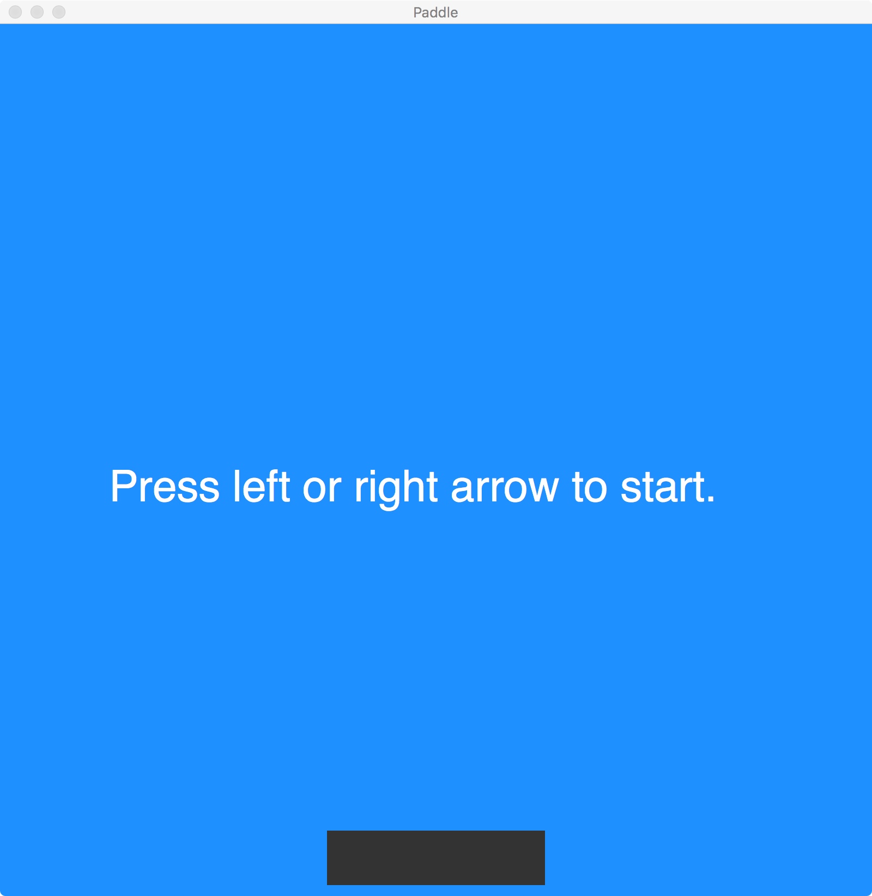
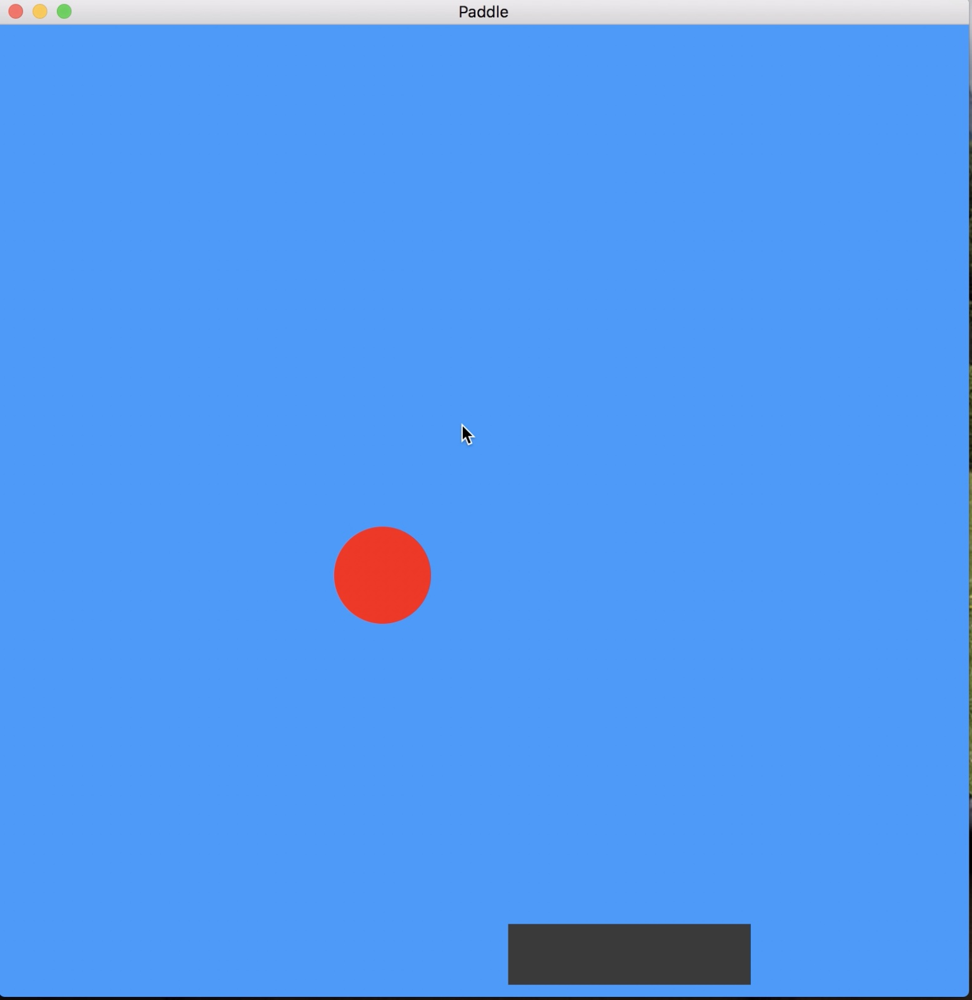
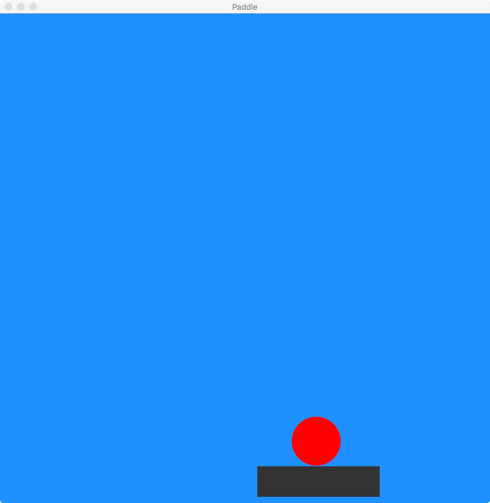

#  CSCI 1103 Computer Science I Honors

### Fall 2017

------

## Problem Set 5 : Paddle

### 10 to 13 Points

### Due Thursday October 19, 2017, Midnight

**Step 0**: This is a pair problem set. Find a class partner to work with. If you don't know a partner you can either use Piazza's partner finding tool or you can ask any course staffer to help you out. 

---
This problem set involves the development of a simple game using the Universe animation features. The basic game is simple: there is a rectangular paddle near the bottom of the display, the player can use the arrow keys to move the paddle left or right. 



As the clock ticks, a ball falls from the top of the display (y = 0) with a randomly chosen x-coordinate. The object of the game for the player is simply to catch the ball with the paddle before it falls through the bottom.

See blow for a number of options for extra credit once the basic game is working.

### Part 1 (4 Points):

In this part, you should implement the basic setup, without any concern for a falling ball — something similar to the image shown above. The image is 800 x 800 pixels with an all-around margin (top, bottom left and right) of 10 pixels. The paddle is at a fixed vertical position (i.e., the y-coordinate) near the bottom, but the horizontal position (i.e., the x-coordinate) varies based on user input (i.e., arrow keys). To represent the paddle, consider using a value of type `paddle`:

```ocaml
type paddle = { x : float }
```

As we described in lecture, an application may be in one of a fixed number of *states*. For part 1, only 2 states would be needed, something like:

```ocaml
type state  = Start | Ready
```

Then the information required to represent the complete status (as for the purposes of Part 1) would include both the paddle and the state:

```ocaml
type model  = { state  : state
              ; paddle : paddle
              }
```

#### Model-View-Update

As we described in class, the Universe library contains a `World` module that implements a `big_bang` function that can be used to implement the so-called *model-view-update* app design (or "architecture"). In a model-view-update architecture, the app transitions through its lifecycle synchronously with a ticking clock. At each clock tick, a `view` function is called. The `view` function uses the information in the model to produce an image reflecting the state of the app:

```ocaml
view : model -> Image.t
```

In addition, the model-view-update architecture has an `update` function that is called on each clock-tick. The `update` function accepts the current model and produces a new model:

```ocaml
update : model -> model
```

NB: If the `update` function wants to return a model `m`, the OCaml code should be written as `World m`. In addition to the `update` function that is called on each clock tick, the `big_bang` function also accepts functions that are called when various asynchronous events occur. A call of the `big_bang` function might look as follows:

```ocaml
let go () = 
  World.big_bang { state = Start; paddle = { x = 50. } }
    ~name: "Paddle"
    ~width: 800.0
    ~height: 800.0
    ~to_draw: view
    ~on_tick: update
    ~on_key_press: handleKey
    ~rate: 0.02
    ~stop_when: finished
    ~to_draw_last: view
```

When the app is in the `Start` state the `view` function should produce an image like the one shown above with text instructing the user how to get started (see `Image.text`). When the app is in the `Start` state, the `update` function should stay in the same state (i.e., the model shouldn't change). 

When the left or right arrow keys are pressed and the app is in the `Start` state, the app should transition from the `Start` state to the `Ready` state:

```ocaml
let handleKey model key =
  match (model, key) with
  | (Start, "left") | (Start, "right") -> World { model with state = Ready }
  | (Ready, "left")  -> ... move the paddle left ...
  | (Ready, "right") -> ... move the paddle right ...
```

When the app is in the `Ready` state, the `view` function should show only the paddle (and not the text). When the app is in the `Ready` state, the `update` function should stay in the same state. Finally, when the app is in the `Ready` state, the app should allow the user to move the paddle left and right at will. For part 1, the `finished` function should simply return `false`.

### Part 2 (6 Points): 

Assuming that you have part 1 working, now you should extend your code by adding the falling ball. In this game, a ball has a fixed radius and color and varying x-coordinates and y-coordinates:

```ocaml
type ball = { x : float; y : float }
```

The initial y-coordinate would place the ball at the top of the display and the initial x-coordinate would be randomly chosen. As the clock ticks, the ball falls toward the bottom of the display. Since the ball's position is changing, the ball must now be included as part of the `model`:

```ocaml
type model  = { state  : state
              ; ball   : ball
              ; paddle : paddle
              }
```

The set of states should be extended to include at least two new states: one for when a ball is falling and one for when the ball has fallen off the bottom and the app is finished. The action of the `update` function on the`Ready` state from part 1 shoud be modified: when in the `Ready` state, the `update` function should create a new ball and then transition to the new falling state. The falling state should cause the `update` function to drop the ball (i.e., increase its y-coordinate) and to check whether or not it hit the paddle or fell through the bottom. If the ball hits the paddle, the app should transition from the falling state to the new finished state. This should cause the app to halt. The `view` and `on_key_press` functions from above will also need to be modified accordingly to account for the additional states and the ball.

  

### Extra Credit

There are many ways to earn extra credit.

1. (1 Point) Keep score — drop one ball at a time, one point for each catch. Display the score in text. When the ball hits the paddle, increment the score, and drop another ball as before. Game over when a ball falls through.

2. (2 Points) Allow more than one ball to fall at a time.

3. (2 Points) When a ball hits the paddle, have it "bounce" up and off the display to one side or another either randomly or depending on the movement of the paddle.

4. (2 Points) Have the ball obey the laws of gravity, both as it falls and as it bounces.

5. (2 Points) Build a paddle with a raised surface as in:

   ```ocaml
             --
        ------------
    --------------------
    --------------------
   ```

   Have the direction of the ball's bound depend on where the ball hit the paddle.

6. (3 Points) Propose your own idea to a staffer (at most 3 points extra credit).